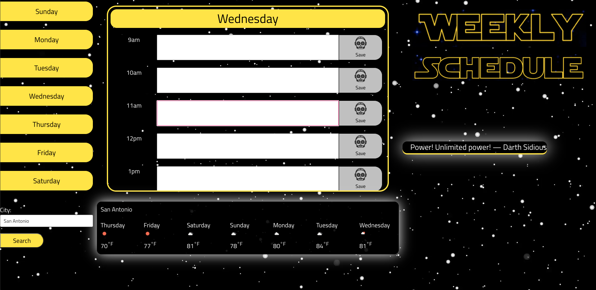

# Weekly-Business-Calendar

Description

This project is work with a group to build an app that solves a real-world problem by integrating data received from multiple server-side API requests. 

Technologies Used

We used GitHub, VS Code, Terminal, Bash, Bulma, OpenWeather API, and Swagger Star Wars Quote API

Screenshot

My Links:

https://rtleib.github.io/Star-Wars-Weekly-Scheduler/

https://github.com/rtleib/Star-Wars-Weekly-Scheduler

